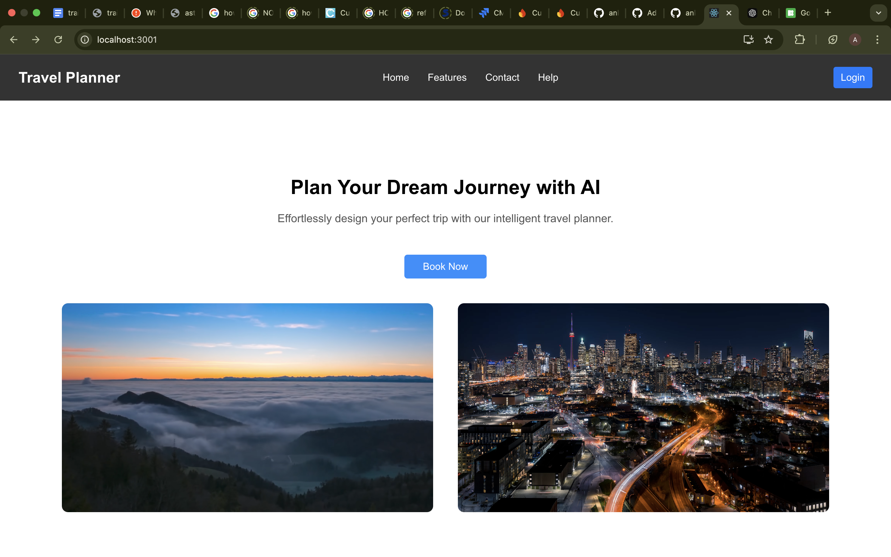
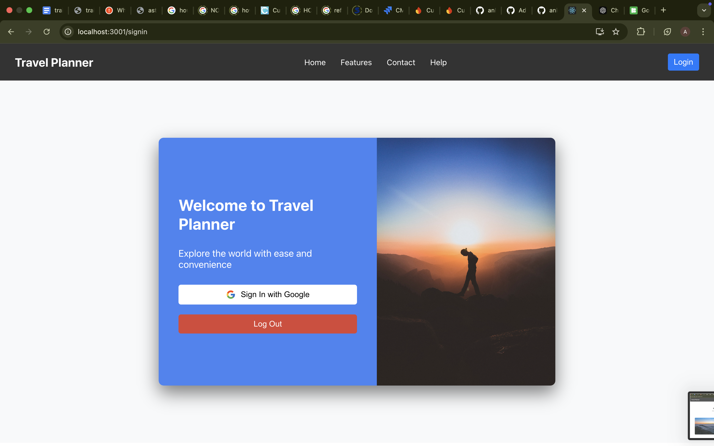
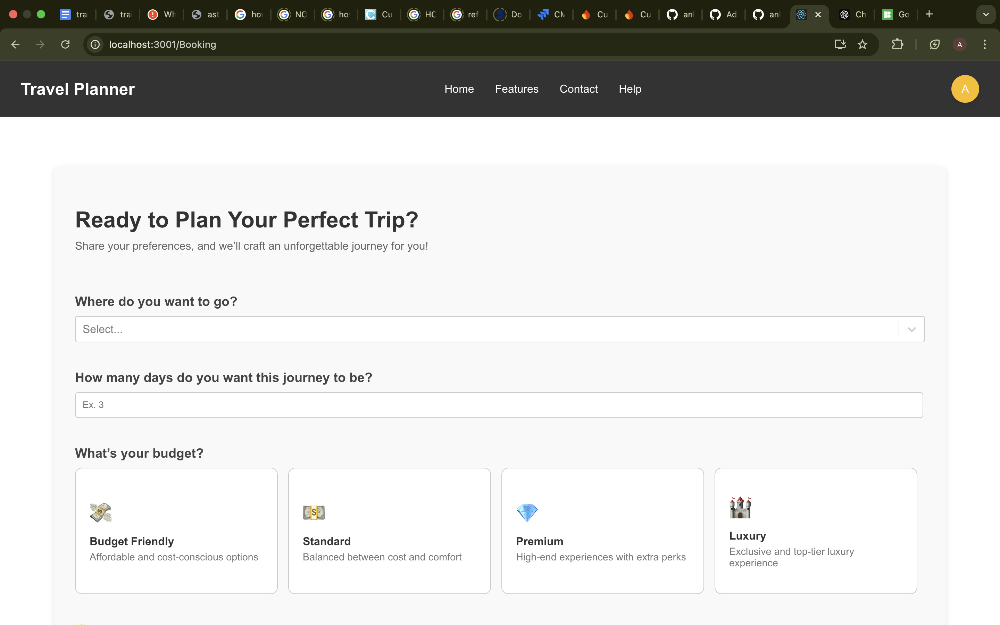

# AI Travel Planner

AI Travel Planner is a smart, personalized travel assistant designed to help users plan their trips by suggesting destinations, hotels, places of interest, and photos based on their preferences. The app integrates advanced AI algorithms, powered by the Gemini API, to provide tailored recommendations. It also leverages the Google Maps API for navigation and the Google Text & Photos Search API to provide relevant images and details about suggested locations.

## Features

- **Personalized Travel Recommendations**: The AI Travel Planner uses Gemini's powerful language model to analyze your preferences and suggest travel destinations, hotels, and places to visit.
- **Smart Navigation**: Powered by the Google Maps API, it provides turn-by-turn directions to your selected destinations and ensures you never lose your way.
- **Image and Photo Search**: Using Google’s Text & Photos Search API, the app fetches images and details of places, hotels, and tourist attractions to give you a visual preview of your travel destinations.
- **User-Friendly Interface**: Clean and intuitive design that allows you to easily interact with the app and get suggestions based on your input.






## Technologies Used

- **Gemini API**: AI-based recommendation system that understands user preferences and suggests personalized destinations, hotels, and places.
- **Google Maps API**: Provides navigation and location-based services for users to get directions and find destinations.
- **Google Text & Photos Search API**: Fetches images and relevant text data about places, hotels, and tourist attractions.

## Setup Instructions

To run the project locally, follow these steps:

### Prerequisites

- **Node.js**: LTS version (download from [Node.js](https://nodejs.org/)).
- **Google Cloud Account**: For accessing Google Maps API and Text & Photos Search API credentials.
- **Gemini API Key**: You will need to obtain an API key for Gemini.

### Steps to Run the Application Locally

1. **Clone the repository**:
   ```bash
   git clone https://github.com/yourusername/ai-travel-planner.git
   cd ai-travel-planner

first install node modules in the project   

### `npm install`


In the project directory, you can run:

### `npm start`

Runs the app in the development mode.\
Open [http://localhost:3000](http://localhost:3000) to view it in your browser.

The page will reload when you make changes.\
You may also see any lint errors in the console.

### `npm test`

Launches the test runner in the interactive watch mode.\
See the section about [running tests](https://facebook.github.io/create-react-app/docs/running-tests) for more information.

### `npm run build`

Builds the app for production to the `build` folder.\
It correctly bundles React in production mode and optimizes the build for the best performance.

The build is minified and the filenames include the hashes.\
Your app is ready to be deployed!

See the section about [deployment](https://facebook.github.io/create-react-app/docs/deployment) for more information.


